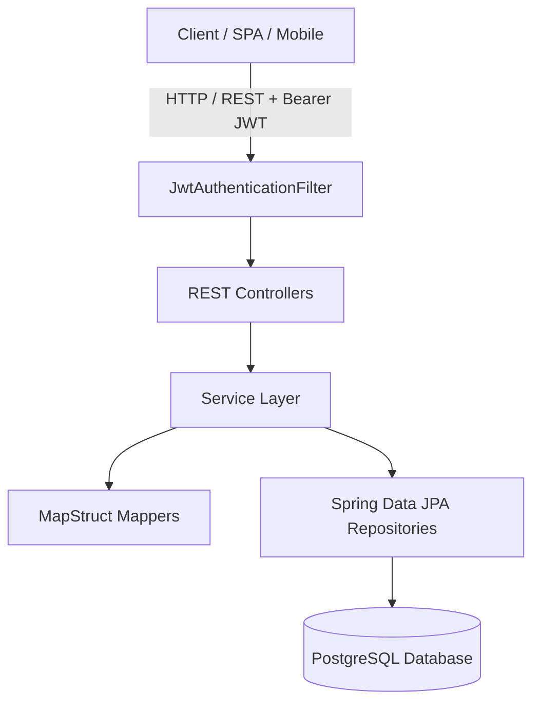
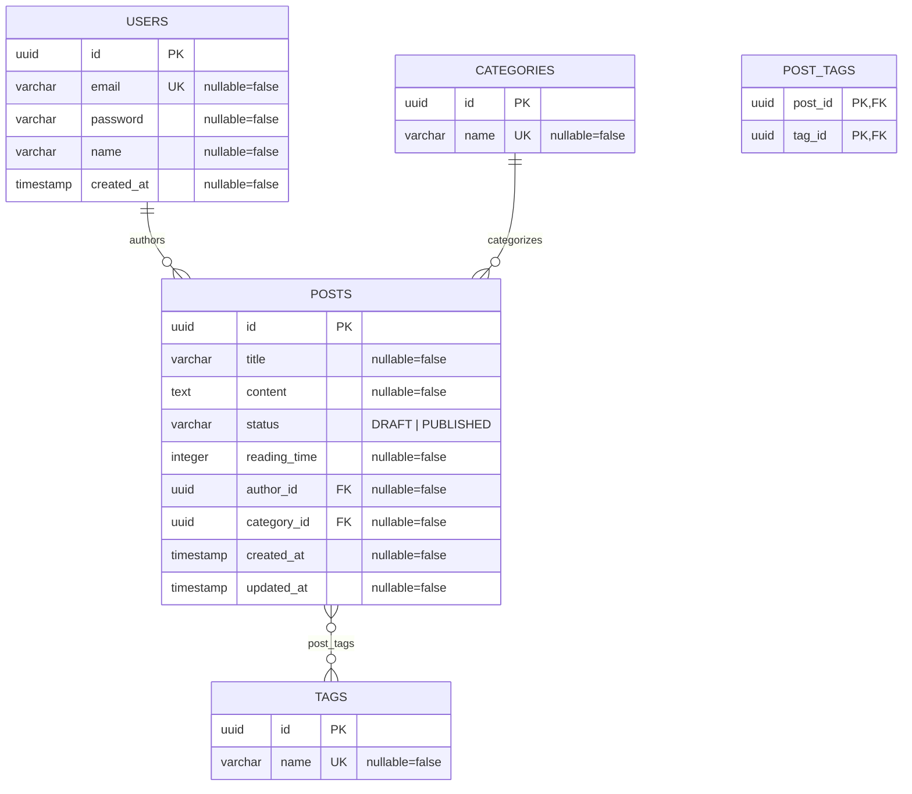

# 📝 Spring Boot Blog Engine & Publishing Platform API

A robust, secure, and production-ready RESTful Blog API engine built with **Java 17**, **Spring Boot**, **Spring Security**, **JWT (JSON Web Tokens)**, **Spring Data JPA / Hibernate**, and **PostgreSQL**.

---

## 📑 Table of Contents

- [Overview](#-overview)
- [Architecture & Tech Stack](#-architecture--tech-stack)
- [Database Schema & ER Diagram](#-database-schema--er-diagram)
- [Features Implemented](#-features-implemented)
- [API Reference](#-api-reference)
  - [Authentication](#authentication)
  - [Posts](#posts)
  - [Categories](#categories)
  - [Tags](#tags)
- [Getting Started](#-getting-started)
  - [Prerequisites](#prerequisites)
  - [Environment Configuration](#environment-configuration)
  - [Running with Docker Compose](#running-with-docker-compose)
  - [Building and Running the Application](#building-and-running-the-application)
- [Testing](#-testing)
- [Enterprise & Production Roadmap](#-enterprise--production-roadmap)
  - [Phase 1: Critical Fixes & Security Hardening](#phase-1-critical-fixes--security-hardening)
  - [Phase 2: High Performance & Scalability](#phase-2-high-performance--scalability)
  - [Phase 3: Advanced Domain Features](#phase-3-advanced-domain-features)
  - [Phase 4: Observability, DevOps & Reliability](#phase-4-observability-devops--reliability)
- [License](#-license)

---

## 🌟 Overview

The **Spring Boot Blog Engine** provides a backend foundation for modern publishing platforms, personal developer blogs, and enterprise content management systems (CMS). It incorporates:

- **Stateless JWT Authentication** with bcrypt password hashing and token-based request authorization.
- **Content Management** supporting rich markdown/text post creation, automated reading time estimation, category taxonomies, and multi-tag associations.
- **DTO Layer & MapStruct Mapping** for entity-DTO decoupling without manual boilerplate.
- **Centralized Error Handling** providing uniform, RFC-compliant error responses with field-level validation feedback.

---

## 🛠 Architecture & Tech Stack



| Layer | Technologies | Description |
| :--- | :--- | :--- |
| **Language & Runtime** | Java 17 (LTS) | Modern Java language features (records, pattern matching, switch expressions) |
| **Framework** | Spring Boot | Core dependency injection, web MVC, and auto-configuration |
| **Security** | Spring Security, JJWT (`0.12.6`), BCrypt | Stateless JWT verification, request filtering, password hashing |
| **Persistence** | Spring Data JPA, Hibernate, PostgreSQL | ORM mapping, repositories, schema management |
| **Mapping & Utils** | MapStruct (`1.6.3`), Lombok | Compile-time bean mapping and code generation |
| **Validation** | Jakarta Bean Validation (Hibernate Validator) | Request body and field constraint validation |
| **Testing** | JUnit 5, Mockito, Spring Boot Starter Test, H2 | Unit and integration testing |
| **Infrastructure** | Docker, Docker Compose, Adminer | Containerized local PostgreSQL and database GUI |

---

## 🗄 Database Schema & ER Diagram



---

## 🚀 Features Implemented

- 🔒 **User Authentication & Signup**: Register with validation (strict password policy, unique email) and receive a signed JWT token on login.
- ✍️ **Post Lifecycle**:
  - Create, read, update, and delete posts with status (`DRAFT`, `PUBLISHED`).
  - Automatic reading time calculation based on word count.
  - Dedicated drafts retrieval endpoint for authenticated authors.
  - Filter published posts by `categoryId`, `tagId`, or both.
- 📂 **Category & Tag Taxonomy**:
  - Create and manage categories and tags.
  - Bulk tag creation with automatic deduplication.
  - Real-time published post count calculation per category and tag.
  - Safeguard against deleting categories or tags with attached posts.
- 🛡️ **Defensive Exception Handling**:
  - Uniform `ErrorResponse` structure returning status codes, timestamps, paths, and field-level validation breakdowns.

---

## 📡 API Reference

All protected endpoints require the HTTP header:
```http
Authorization: Bearer <your_jwt_token>
```

### Authentication

| Method | Endpoint | Auth | Description | Status Codes |
| :--- | :--- | :--- | :--- | :--- |
| `POST` | `/api/auth/signup` | Public | Register a new user account | `201 Created`, `400 Bad Request`, `409 Conflict` |
| `POST` | `/api/auth/login` | Public | Authenticate user and receive JWT | `200 OK`, `401 Unauthorized` |

#### Signup Request Example:
```json
{
  "name": "John Doe",
  "email": "john.doe@example.com",
  "password": "SecurePassword123!",
  "confirmPassword": "SecurePassword123!"
}
```

#### Login Response Example:
```json
{
  "token": "eyJhbGciOiJIUzI1NiIsInR5cCI6IkpXVCJ9...",
  "expiresIn": 21600000
}
```

---

### Posts

| Method | Endpoint | Auth | Description | Status Codes |
| :--- | :--- | :--- | :--- | :--- |
| `GET` | `/api/posts` | Public | List all published posts (optional query params: `categoryId`, `tagId`) | `200 OK` |
| `GET` | `/api/posts/{id}` | Public | Get single post details by UUID | `200 OK`, `404 Not Found` |
| `GET` | `/api/posts/drafts` | Bearer Token | Get current authenticated user's draft posts | `200 OK`, `401 Unauthorized` |
| `POST` | `/api/posts` | Bearer Token | Create a new blog post | `200 OK`, `400 Bad Request`, `401 Unauthorized` |
| `PUT` | `/api/posts/{id}` | Bearer Token | Update an existing post | `200 OK`, `400 Bad Request`, `404 Not Found` |
| `DELETE` | `/api/posts/{id}` | Bearer Token | Delete a blog post | `204 No Content`, `404 Not Found` |

#### Create Post Request Example:
```json
{
  "title": "Getting Started with Spring Boot and JPA",
  "content": "Spring Boot makes it easy to create stand-alone, production-grade Spring based Applications...",
  "status": "PUBLISHED",
  "categoryId": "3fa85f64-5717-4562-b3fc-2c963f66afa6",
  "tagIds": [
    "7b8c9d0e-1234-4567-89ab-cdef01234567"
  ]
}
```

---

### Categories

| Method | Endpoint | Auth | Description | Status Codes |
| :--- | :--- | :--- | :--- | :--- |
| `GET` | `/api/categories` | Public | List all categories with published post counts | `200 OK` |
| `POST` | `/api/categories` | Bearer Token | Create a new category | `201 Created`, `400 Bad Request` |
| `DELETE` | `/api/categories/{id}` | Bearer Token | Delete an empty category | `204 No Content`, `409 Conflict` |

#### Create Category Request Example:
```json
{
  "name": "Software Engineering"
}
```

---

### Tags

| Method | Endpoint | Auth | Description | Status Codes |
| :--- | :--- | :--- | :--- | :--- |
| `GET` | `/api/tags` | Public | List all tags with published post counts | `200 OK` |
| `POST` | `/api/tags` | Bearer Token | Bulk create tags (ignores existing duplicates) | `201 Created`, `400 Bad Request` |
| `DELETE` | `/api/tags/{id}` | Bearer Token | Delete an empty tag | `204 No Content`, `409 Conflict` |

#### Bulk Create Tags Request Example:
```json
{
  "names": ["Java", "Spring Boot", "DevOps", "Microservices"]
}
```

---

## ⚡ Getting Started

### Prerequisites

- **Java JDK 17** or higher
- **Maven 3.8+** (or use included `./mvnw`)
- **Docker & Docker Compose** (for PostgreSQL)

---

### Environment Configuration

Create or update your environment variables or `src/main/resources/application.properties`:

```properties
spring.application.name=blog

# Database Configuration
spring.datasource.url=jdbc:postgresql://localhost:5432/postgres
spring.datasource.username=postgres
spring.datasource.password=${DB_PASSWORD:changemeinprod!}

# Hibernate & JPA
spring.jpa.hibernate.ddl-auto=update
spring.jpa.show-sql=false
spring.jpa.properties.hibernate.format_sql=true

# JWT Security
jwt.secret=${JWT_SECRET:my-super-secret-key-that-is-32-chars}
jwt.expirationMs=${JWT_EXPIRATION_MS:21600000}
```

---

### Running with Docker Compose

Spin up the local PostgreSQL database and Adminer web interface:

```bash
docker compose up -d
```

- **PostgreSQL**: `localhost:5432` (Username: `postgres`, Password: `changemeinprod!`, Database: `postgres`)
- **Adminer Database Manager**: `http://localhost:8888`

To stop the containers:
```bash
docker compose down
```

---

### Building and Running the Application

```bash
# On Linux / macOS
./mvnw clean spring-boot:run

# On Windows (PowerShell / Command Prompt)
.\mvnw.cmd clean spring-boot:run
```

The application will start on `http://localhost:8080`.

---

## 🧪 Testing

Run unit and integration tests using Maven:

```bash
# Run all tests
.\mvnw.cmd test

# Run tests with test report generation
.\mvnw.cmd test-compile
```

---

## 🏗 Enterprise & Production Roadmap

To evolve this project into an enterprise-grade, high-scale digital publishing platform, the following architectural, functional, and operational enhancements are recommended:

```
                               ENTERPRISE MATURITY ROADMAP
 ┌──────────────────────┐    ┌──────────────────────┐    ┌──────────────────────┐    ┌──────────────────────┐
 │   PHASE 1: SECURE    │    │   PHASE 2: SCALE     │    │   PHASE 3: ENGAGE    │    │   PHASE 4: OPERATE   │
 │                      │    │                      │    │                      │    │                      │
 │ • Fix IDOR Security  │───►│ • Aggregation Proj.  │───►│ • Comments & Replies │───►│ • Flyway Migrations  │
 │ • PathVariable Bug   │    │ • JPA Entity Graphs  │    │ • Full-Text Search   │    │ • OpenAPI / Swagger  │
 │ • RBAC (Roles/Perms) │    │ • Pageable/Sorting   │    │ • S3 Media Uploads   │    │ • Micrometer Metrics │
 │ • CORS Configuration │    │ • Redis 2nd Cache    │    │ • SEO Slugs & Feeds  │    │ • Docker & K8s CI/CD │
 └──────────────────────┘    └──────────────────────┘    └──────────────────────┘    └──────────────────────┘
```

### Phase 1: Critical Fixes & Security Hardening

- [ ] **Fix Missing `@PathVariable` in `PostController`**: Add `@PathVariable` on `deletePost(UUID id)`.
- [ ] **Enforce `@Valid` on `createPost`**: Validate incoming `CreatePostRequest` payload.
- [ ] **Author Ownership & IDOR Protection**: Prevent authors from modifying or deleting other users' posts via `@PreAuthorize("@postSecurity.isAuthor(#id, authentication)")` or service-level verification.
- [ ] **Role-Based Access Control (RBAC)**:
  - Introduce `Role` entity / enum (`ROLE_ADMIN`, `ROLE_AUTHOR`, `ROLE_READER`).
  - Restrict Category and Tag creation/deletion to `ROLE_ADMIN`.
- [ ] **Lombok `@Builder.Default` Corrections**: Add `@Builder.Default` to `User.posts`, `Post.tags`, `Category.posts`, and `Tag.posts` to avoid `NullPointerException` on built entities.
- [ ] **JWT Refresh Tokens & Revocation**:
  - Implement short-lived Access Tokens (e.g. 15 mins) and long-lived Refresh Tokens (e.g. 7 days).
  - Implement token revocation and logout via Redis blacklist.
- [ ] **CORS Configuration**: Configure `CorsConfigurationSource` to allow authorized frontend origins (e.g., Next.js, React).
- [ ] **Rate Limiting & Brute Force Protection**: Implement Bucket4j / Redis token-bucket rate limiting on `/api/auth/login` and `/api/auth/signup`.

---

### Phase 2: High Performance & Scalability

- [ ] **Replace In-Memory Post Counting**:
  - Replace `findAllWithPosts()` in `CategoryRepository` and `TagRepository` with a single SQL/JPQL aggregation query using DTO projections (`COUNT(p.id)`) to prevent high memory consumption and OOM errors.
- [ ] **Eliminate N+1 Queries with `@EntityGraph`**:
  - Add `@EntityGraph(attributePaths = {"author", "category", "tags"})` on `PostRepository` queries.
- [ ] **Pagination and Dynamic Sorting**:
  - Convert `getAllPosts` and `getUserDraftPosts` to return `Page<PostDto>` using Spring's `Pageable`.
- [ ] **Database Indexing**:
  - Create composite indexes on `posts(status, created_at)`, `posts(author_id, status)`, and `posts(category_id)`.
- [ ] **Distributed Caching (Spring Cache + Redis)**:
  - Cache frequently read, rarely changed data (e.g., categories list, popular tags, trending posts).
- [ ] **Database Connection Pooling**:
  - Tune HikariCP connection pool parameters (`maximum-pool-size`, `minimum-idle`, `leak-detection-threshold`).

---

### Phase 3: Advanced Domain Features

- [ ] **SEO-Friendly Post Slugs**:
  - Add an auto-generated, URL-safe `slug` field (e.g., `getting-started-with-spring-boot`) with unique indexing and `GET /api/posts/slug/{slug}` endpoint.
- [ ] **Dynamic Search & Filtering (JPA Specification / QueryDSL / Elasticsearch)**:
  - Support multi-field search (title, content, author, tag, date range) in a single dynamic endpoint.
  - Option to integrate Elasticsearch or PostgreSQL Full-Text Search (TSVECTOR / GIN indexes).
- [ ] **Comments & Nested Discussions**:
  - Add `Comment` entity supporting hierarchical/nested replies, comment moderation, and user mentions.
- [ ] **Media & Image Storage (AWS S3 / Cloudinary / MinIO)**:
  - File upload service for post cover images, author avatars, and inline media.
- [ ] **Post Scheduling & Editorial Workflow**:
  - Support `SCHEDULED` status with automatic publishing via scheduled background worker (Spring `@Scheduled` or Quartz).
- [ ] **User Profiles & Social Features**:
  - Author bios, profile avatars, post bookmarking/favorites, and like counters.
- [ ] **RSS / Atom Feeds & Newsletter Subscriptions**:
  - Auto-generated `/feed.xml` and email notifications for new articles.

---

### Phase 4: Observability, DevOps & Reliability

- [ ] **Database Migrations (Flyway / Liquibase)**:
  - Remove `hibernate.ddl-auto=update` and manage version-controlled SQL migration scripts.
- [ ] **Interactive API Documentation (OpenAPI 3 / Swagger UI)**:
  - Add `springdoc-openapi-starter-webmvc-ui` for live interactive API playground (`/swagger-ui.html`).
- [ ] **Production Observability & Metrics (Spring Actuator + Prometheus + Grafana)**:
  - Expose `/actuator/health`, `/actuator/metrics`, and JVM performance metrics.
- [ ] **Structured Logging & Tracing**:
  - Logback JSON appender with correlation IDs (`MDC`) and distributed tracing with Micrometer / OpenTelemetry.
- [ ] **Production Multi-Stage Dockerfile**:
  - Build lightweight Docker images using Eclipse Temurin JRE alpine base image.
- [ ] **CI/CD Pipeline (GitHub Actions)**:
  - Automated build, test, linting, sonar code quality analysis, and container registry publishing on push/PR.
- [ ] **Automated Test Suite**:
  - MockMvc controller tests (`@WebMvcTest`), Service unit tests with Mockito, and database integration tests using **Testcontainers** (real PostgreSQL instances in test).

